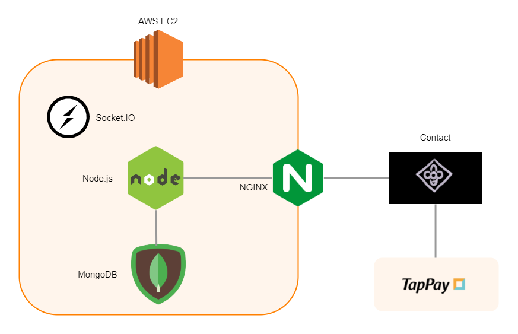

<div align='center'>
  <h1>Contact</h1>
  
  <p>A chat platform between artists and fans, just like JYP bubble or Lysn, which aims to let entertainment companies easily manage the contact between artists and their fans.</p>
  <p>For the fans, they can enjoy communicating with their subscibed artists with chats just like ordinary one-to-one chat room; However, for the artists, they can enjoy communicating with their subsciption fans with a single chat just like one-to-many chat room.</p>
  <p>By such design, Contact can offer a enjoyable yet maintainable chat platform for entertainment companies.</p>
  <!-- <a href="34.208.177.77"><strong>Link »</strong></a>
  <p>Sample Account
  <br />
    EMAIL: fanone@gmail.com
  <br />
    PASSWORD: fanone
  </p> -->
</div>

---

### Some demo (not recorded in the same time)
* At fans side (timeline: earlier) 


* At artist side (timeline: after)

---
## About Contact
Fans can communicate with their favorite artists by chat! Contact is a well functioned chat platform that makes the communication between artists and fans easier. With subscription, using small amount of money, a fan can enjoy the close in-touch with her or his favorite artists.

Main features of Contact:

- **Chat:** real-time chatting room
- **Support:** Provides Taypay to support subscription
- **Personalization:** Provides changes to avatar and quotes
---
## System Architecture

<!-- 
---
## Database Schema

 -->

---
## Technologies

- **Backend:** Node.js, Express.js, NGINX, RESTful API, MVC

- **Frontend:** React.js, Styled-Components, SweetAlert2

- **Database:** MongoDB

- **Cloud Service:** AWS Elastic Compute Cloud (EC2)

- **3rd Party APIs and Open Source Tools:** Socket.IO, TapPay SDK
---
## How to Maintain the service by self
1. Clone the repository
   ```bash
   $ git clone https://github.com/dynamiteNing/Contact
   ```
2. Build the frontend
   ```bash
   $ cd Contact/frontend
   ```
   ```bash
   $ npm run build
   ```
3. Create your own MongoDB with the structure
   * contact
       * register -- with your artist email and fanclub
       * member -- initial empty
       * subscription -- initial empty
       * chatHistory -- initial empty
4. Start the service
   ```bash
   $ cd Contact/backend
   ```
   ```bash
   $ debug=backend:* npm start
   ```
Voila!

---
## References
- Avatar:<br />
  * https://spy-family.net/special/special9.php
- Icons from Flaticon:<br/>
  * <a href="https://www.flaticon.com/free-icons/subscriber" title="subscriber icons">Subscriber icons created by Ferdinand - Flaticon</a>
  * <a href="https://www.flaticon.com/free-icons/buy" title="buy icons">Buy icons created by Freepik - Flaticon</a>
  * <a href="https://www.flaticon.com/free-icons/directory" title="directory icons">Directory icons created by SumberRejeki - Flaticon</a>
  * <a href="https://www.flaticon.com/free-icons/chat" title="chat icons">Chat icons created by Kiranshastry - Flaticon</a>
  * <a href="https://www.flaticon.com/free-icons/logout" title="logout icons">Logout icons created by SumberRejeki - Flaticon</a>
  * <a href="https://www.flaticon.com/free-icons/cursor" title="cursor icons">Cursor icons created by zky.icon - Flaticon</a>
  * <a href="https://www.flaticon.com/authors/pixel-perfect" title="Pixel perfect"> Pixel perfect </a>
  * <a href="https://www.flaticon.com/free-icons/online-payment" title="online-payment icons">Online-payment icons created by Freepik - Flaticon</a>
  * <a href="https://www.flaticon.com/free-icons/login" title="login icons">Login icons created by Pixel perfect - Flaticon</a>
  * <a href="https://www.flaticon.com/free-icons/ui" title="ui icons">Ui icons created by Ahmer - Flaticon</a>